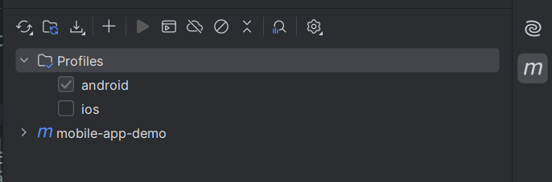

# Mobile Automation Using Appium For Android & iOS

This project defines the automation of android and iOS apps having same UI structure. In this, the codebase is same for
android and ios. Appium and testng library are used to do the automation execution. Also there is maven profiling as
well to select the platform environment (android/iOS) on which you want to run the code.

## Prerequisites for the project

1. Java and set JAVA_HOME
2. Maven and set MAVEN_HOME
3. NodeJS
4. Android Studio
5. Android SDK and set ANDROID_HOME
6. Xcode
7. IDE (preferred: IntelliJ)
8. Appium 2.0

   `npm install -g appium`

9. Appium Drivers

   `appium driver install uiautomator2`

   `appium driver install xcuitest`

## Execution of Test Cases

Steps:

1. Connect real device or open simulator with the system and update the `android` or `ios` app and device details
   in [config.properties](src/test/resources/config.properties)
2. Check the [testng.xml](testng.xml) and update or edit the classes and methods based on the need
3. You can run the test cases using Intellij and terminal.
    1. **Intellij ::**
        - Open maven profiles and select `android` or `ios` as the platform (by default `android` will be
          selected)
          
        - Execute the [testng.xml](testng.xml)
        - You can see the results in the reports folder based on the latest execution.
    2. **Terminal ::**

    * To run the test suite for android platform

      `mvn clean test -Pandroid`
    * To run the test suite for iOS platform

      `mvn clean test -Pios`

